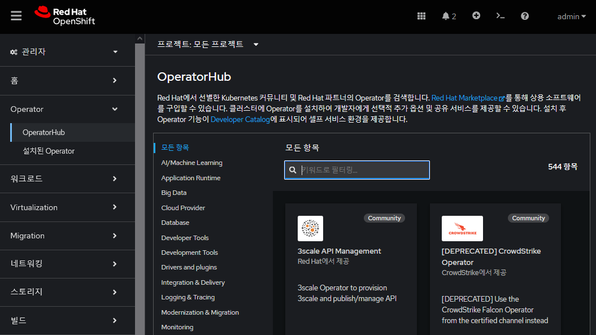
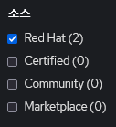
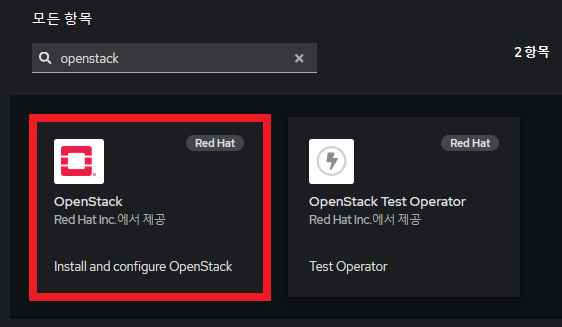
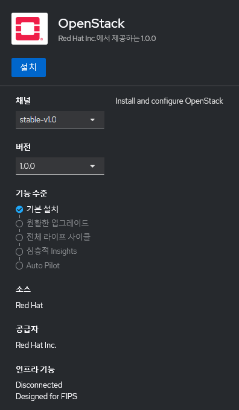
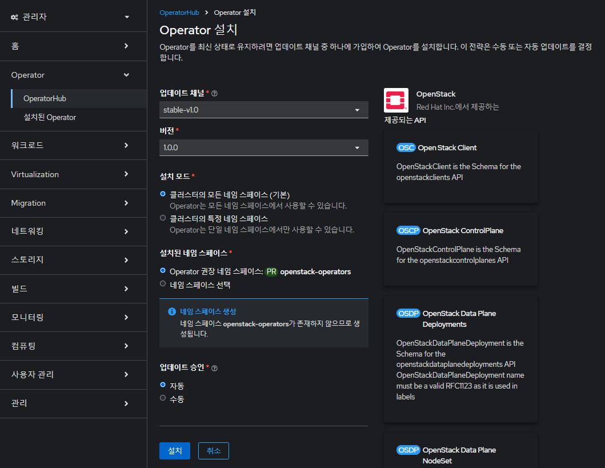
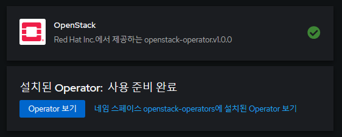
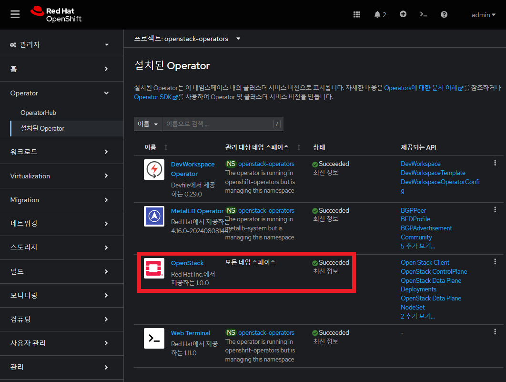

# 오픈스택 오퍼레이터 설치

## 1.

### 1.1 오픈스택 서비스를 위한 스토리지 구성

#### 1.1. 

생성된 *my-lvmcluster* 파일 확인

```yaml
apiVersion: lvm.topolvm.io/v1alpha1
kind: LVMCluster
metadata:
  creationTimestamp: '2024-08-23T07:52:09Z'
  finalizers:
    - lvmcluster.topolvm.io
  generation: 1
  managedFields:
    - apiVersion: lvm.topolvm.io/v1alpha1
      fieldsType: FieldsV1
      fieldsV1:
        'f:spec':
          .: {}
          'f:storage':
            .: {}
            'f:deviceClasses': {}
      manager: Mozilla
      operation: Update
      time: '2024-08-23T07:52:09Z'
    - apiVersion: lvm.topolvm.io/v1alpha1
      fieldsType: FieldsV1
      fieldsV1:
        'f:metadata':
          'f:finalizers':
            .: {}
            'v:"lvmcluster.topolvm.io"': {}
      manager: lvms
      operation: Update
      time: '2024-08-23T07:52:09Z'
    - apiVersion: lvm.topolvm.io/v1alpha1
      fieldsType: FieldsV1
      fieldsV1:
        'f:status':
          .: {}
          'f:deviceClassStatuses': {}
          'f:ready': {}
          'f:state': {}
      manager: lvms
      operation: Update
      subresource: status
      time: '2024-08-23T22:30:03Z'
  name: my-lvmcluster
  namespace: openshift-storage
  resourceVersion: '4544280'
  uid: a15b3ae6-4299-4100-baeb-253e1a69712d
spec:
  storage:
    deviceClasses:
      - default: true
        deviceSelector:
          paths:
            - /dev/vdd
        fstype: xfs
        name: openstack-vg
        nodeSelector:
          nodeSelectorTerms:
            - matchExpressions:
                - key: node-role.kubernetes.io/worker
                  operator: Exists
        thinPoolConfig:
          chunkSizeCalculationPolicy: Static
          name: openstack-pool
          overprovisionRatio: 10
          sizePercent: 90
status:
  deviceClassStatuses:
    - name: openstack-vg
      nodeStatus:
        - deviceDiscoveryPolicy: Preconfigured
          devices:
            - /dev/vdd
          name: openstack-vg
          node: ocp4-worker1.aio.example.com
          status: Ready
        - deviceDiscoveryPolicy: Preconfigured
          devices:
            - /dev/vdd
          name: openstack-vg
          node: ocp4-worker2.aio.example.com
          status: Ready
        - deviceDiscoveryPolicy: Preconfigured
          devices:
            - /dev/vdd
          name: openstack-vg
          node: ocp4-worker3.aio.example.com
          status: Ready
  ready: true
  state: Ready
```

### 1.2 오픈스택 서비스를 위한 네트워크 구성

#### 1.2.1 오픈스택 서비스를 위한 네트워크 준비 


#### 1.2.2 오픈스택 서비스를 위한 오픈시프트 상의 네트워크 확인

시스템의 네트워크 확인

```bash
ansible workers -m shell -a "ip -j a|jq '[.[]|select(.ifname|startswith(\"enp\"))|{"ifindex": .ifindex, "ifname": .ifname, "address": .address}]'"
```

출력 결과
```
$ ansible workers -m shell -a "ip -j a|jq '[.[]|select(.ifname|startswith(\"enp\"))|{"ifindex": .ifindex, "ifname": .ifname, "address": .address}]'"
ocp4-worker3 | CHANGED | rc=0 >>
[
  {
    "ifindex": 2,
    "ifname": "enp1s0",
    "address": "de:ad:be:ef:00:06" #ocp4-provisioning
  }
  {
    "ifindex": 3,
    "ifname": "enp2s0",
    "address": "52:54:00:00:00:06" #ocp4-net
  }
  {
    "ifindex": 4,
    "ifname": "enp3s0",
    "address": "52:54:00:00:01:06" #ocp4-flat
  }
  {
    "ifindex": 5,
    "ifname": "enp12s0",
    "address": "52:54:00:1c:02:a5" #oso-net
  }
  {
    "ifindex": 6,
    "ifname": "enp13s0",
    "address": "52:54:00:43:db:23" #oso-br-ex
  }
  {
    "ifindex": 7,
    "ifname": "enp14s0",
    "address": "52:54:00:df:1c:ad" #oso-provision
  }
]
ocp4-worker2 | CHANGED | rc=0 >>
[
  {
    "ifindex": 2,
    "ifname": "enp1s0",
    "address": "de:ad:be:ef:00:05" #ocp4-provisioning
  }
  {
    "ifindex": 3,
    "ifname": "enp2s0",
    "address": "52:54:00:00:00:05" #ocp4-net
  }
  {
    "ifindex": 4,
    "ifname": "enp3s0",
    "address": "52:54:00:00:01:05" #ocp4-flat
  }
  {
    "ifindex": 5,
    "ifname": "enp12s0",
    "address": "52:54:00:89:15:3d" #oso-net
  }
  {
    "ifindex": 6,
    "ifname": "enp13s0",
    "address": "52:54:00:61:2b:c9" #oso-br-ex
  }
  {
    "ifindex": 7,
    "ifname": "enp14s0",
    "address": "52:54:00:98:f6:4f" #oso-provision
  }
]
ocp4-worker1 | CHANGED | rc=0 >>
[
  {
    "ifindex": 2,
    "ifname": "enp1s0",
    "address": "de:ad:be:ef:00:04" #ocp4-provisioning
  }
  {
    "ifindex": 3,
    "ifname": "enp2s0",
    "address": "52:54:00:00:00:04" #ocp4-net
  }
  {
    "ifindex": 4,
    "ifname": "enp3s0",
    "address": "52:54:00:00:01:04" #ocp4-flat
  }
  {
    "ifindex": 5,
    "ifname": "enp12s0",
    "address": "52:54:00:cf:3e:83" #oso-net 
  }
  {
    "ifindex": 6,
    "ifname": "enp13s0",
    "address": "52:54:00:44:fa:3b" #oso-br-ex
  }
  {
    "ifindex": 7,
    "ifname": "enp14s0",
    "address": "52:54:00:7c:45:6b" #oso-provision 
  }
]
```
<br>
<br>

## 2. **OpenStack** 오퍼레이터 확인

### 2.1 오퍼레이터 선택

오픈시프트 콘솔의 왼쪽 메뉴에서, Operator --> OperatorHub를 선태

</img> <br> 

### 2.2 소스 선택

"Red Hat" 소스 선택

</img><br>

### 2.3 *OpenStack* 찾기

검색 창에서 *openstack* 입력하여 오퍼레이터 확인

</img><br>

**OpenStack** 오퍼레이터를 클릭
<br>
<br>

## 3. **OpenStack** 오퍼레이터 설치

### 3.1 채널 및 버전을 확인 후 **설치**를 클릭

</img><br>

### 3.2 오픈스택 오퍼레이터 구성 설정

설치 모드 / 타겟 네임스페이스 / 업데이트 등 설정 후 **설치**를 클릭

</img><br>

* 설치 모드:  클러스터의 모드 네임스페이스
* 타겟 네임스페이스: *openstack-operators*

### 3.3 설치된 오퍼레이터 확인

설치가 완료된 것을 확인

</img><br>

Operator --> 설치된 Operator에서 **OpenStack** 오퍼레이터 확인

</img><br>
<br>
<br>